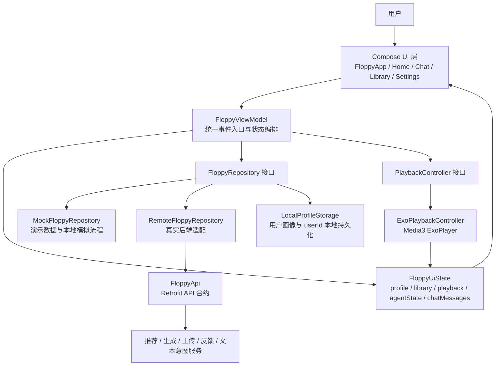
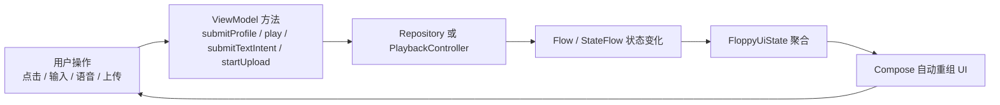
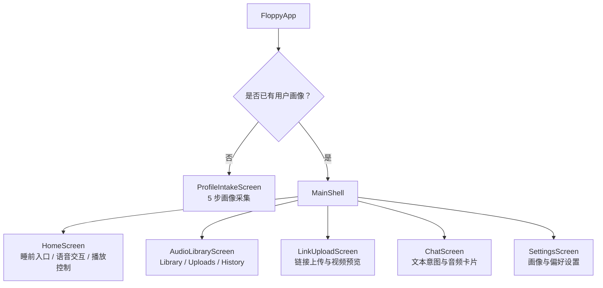
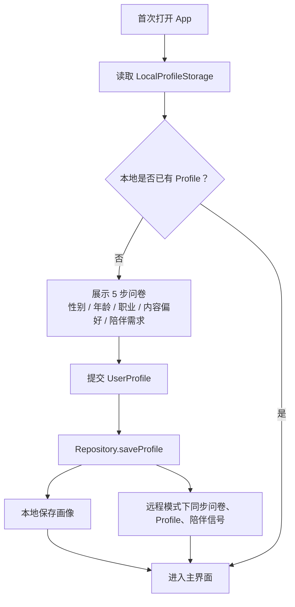
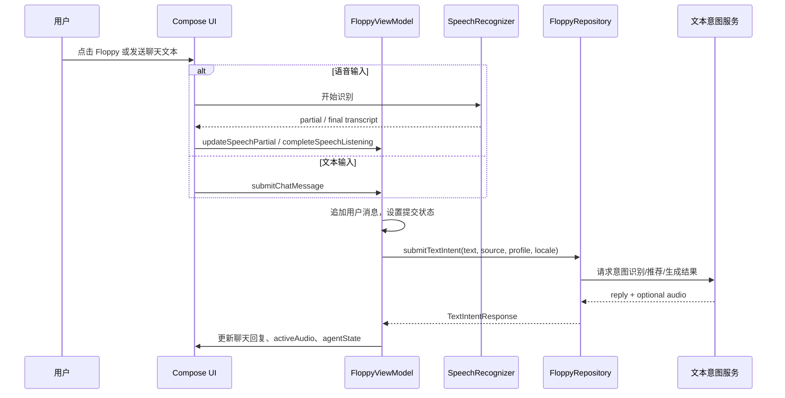
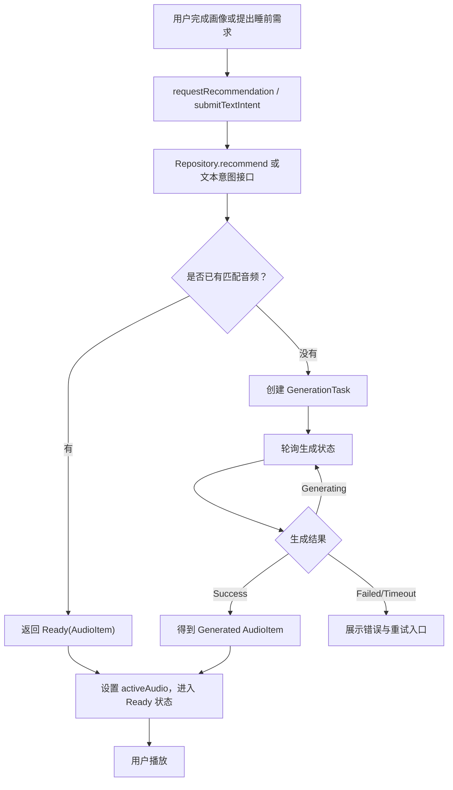
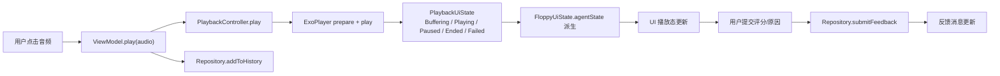
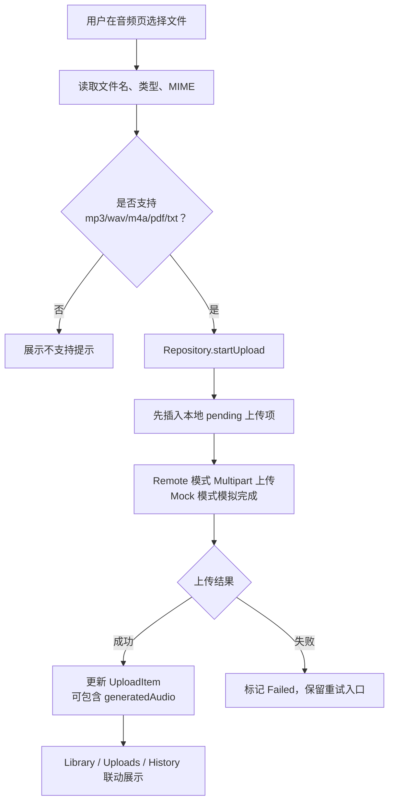

# Floppy 前端架构文档与流程图

## 1. 项目定位

Floppy 是一个睡前音频陪伴类 Android MVP，前端承担用户画像采集、睡前意图输入、音频推荐/生成、播放反馈、上传与历史管理等核心体验。

当前前端采用 Kotlin + Jetpack Compose 构建，整体思路是“声明式 UI + 单向状态流 + Repository 数据抽象 + 可替换的播放/接口适配层”。这让项目既能快速演示，也能平滑切换到真实后端联调。

## 2. 技术栈

| 模块 | 技术 |
| --- | --- |
| UI 框架 | Jetpack Compose、Material 3 |
| 状态管理 | ViewModel、StateFlow、Coroutines |
| 页面组织 | Compose 组件化、主 Tab 状态切换 |
| 数据层 | Repository Pattern、Mock/Remote 双实现 |
| 网络层 | Retrofit、OkHttp、Gson |
| 播放层 | AndroidX Media3 ExoPlayer |
| 本地存储 | SharedPreferences |
| 系统能力 | SpeechRecognizer、文件选择器、WebView、传感器/网络能力检测 |

## 3. 总体架构

### 分层说明

| 层级 | 职责 | 代表文件 |
| --- | --- | --- |
| Application 层 | 初始化全局 Repository，作为依赖入口 | `FloppyApplication.kt` |
| Activity 层 | 开启沉浸式界面，创建播放控制器，挂载 Compose 树 | `MainActivity.kt` |
| UI 层 | 负责页面渲染、交互收集和视觉反馈，不直接处理业务细节 | `FloppyApp.kt` |
| ViewModel 层 | 汇总用户事件、仓库数据、播放状态，输出统一 UI 状态 | `FloppyViewModel.kt` |
| Domain 层 | 定义用户画像、音频、上传、生成任务、反馈等核心模型 | `Models.kt` |
| Data 层 | 隔离 Mock 与真实接口，处理上传、推荐、生成、反馈等数据行为 | `FloppyRepository.kt`、`MockFloppyRepository.kt`、`RemoteFloppyRepository.kt` |
| Playback 层 | 封装播放器实现，向上暴露统一播放状态 | `PlaybackController.kt`、`ExoPlaybackController.kt` |

## 4. 前端状态流

前端的核心是 `FloppyViewModel`。它把 Repository 中的 `profile`、`settings`、`library` 与播放器中的 `playback` 合并为一个 `FloppyUiState`，UI 只订阅这个状态并进行声明式重组。

这种方式让数据更新路径非常清晰：事件从 UI 进入 ViewModel，业务结果回到状态流，UI 不需要关心数据来自 Mock、远程接口还是播放器。

## 5. 页面结构

主页面不是传统多 Activity，而是单 Activity + Compose 状态切换。这样页面间共享同一份 `FloppyUiState`，播放、聊天、历史、上传结果都能自然联动。

## 6. 核心业务流程

### 6.1 首次进入与画像采集流程

亮点：画像不是一次性表单，而是后续推荐、生成、聊天和设置的基础上下文。

### 6.2 语音/聊天意图流程

亮点：语音与文本最终进入同一条文本意图通道，后端只需要围绕统一接口扩展推荐、生成和对话能力。

### 6.3 音频推荐与生成流程

亮点：推荐和生成被封装成统一结果类型 `RecommendationResult`。前端不需要关心命中库音频还是触发 AI 生成，只负责根据状态展示进度和可播放结果。

### 6.4 播放与反馈流程

亮点：播放器被抽象成 `PlaybackController`，后续可以替换为离线播放、后台服务或其他播放器实现，不影响 UI 和业务层。

### 6.5 文件上传流程

亮点：上传状态先进入本地列表，用户能马上看到进度反馈，体验上不会等待远程接口完成后才有反应。

## 7. 架构优点

### 7.1 单向数据流，降低复杂度

UI 不直接修改多个零散状态，而是通过 ViewModel 统一处理事件。所有页面订阅同一个 `FloppyUiState`，状态来源明确，便于定位问题和扩展功能。

### 7.2 Mock-first，演示和联调解耦

`RepositoryFactory` 根据 `BuildConfig.USE_MOCK_API` 切换 Mock 或 Remote。Debug 默认使用 Mock 数据，保证没有后端也能完整演示；Release 或指定配置可以切到真实 API。

### 7.3 接口适配层清晰

`FloppyRepository` 把 UI 需要的能力抽象成稳定接口，真实后端字段转换、URL 修正、Multipart 上传、本地缓存都被隔离在 Data 层。UI 层不会被后端字段变化污染。

### 7.4 播放能力独立封装

播放逻辑被放进 `PlaybackController`，并用 `PlaybackUiState` 对外发布。UI 只关心播放状态，不直接操作 ExoPlayer，便于后续加入后台播放、锁屏控制、播放队列等能力。

### 7.5 用户画像贯穿全链路

画像采集结果不仅用于首页推荐，还会进入设置、文本意图、生成任务、后端 Profile、问卷和事件记录。前端把画像作为持续上下文，而不是孤立的注册信息。

### 7.6 页面体验闭环完整

当前 MVP 已覆盖“画像采集 -> 推荐/生成 -> 播放 -> 历史 -> 反馈 -> 设置调整 -> 再推荐”的闭环，适合用于产品演示和投资/课程汇报。

## 8. 创新点

### 8.1 语音和聊天共用文本意图中枢

用户可以通过语音表达“今晚想听什么”，也可以通过聊天输入需求。前端把两种输入统一转换为 `TextIntentRequest`，后端可以在一个入口里判断是推荐、生成、播放某个音频，还是普通陪伴对话。

### 8.2 推荐与生成一体化

系统优先推荐现有音频，无法命中时自然进入生成任务。这个设计兼顾效率和个性化：有内容时快速响应，没有内容时用 AI 生成补足长尾需求。

### 8.3 陪伴型状态机

`AgentState` 不只是技术状态，而是产品表达状态：Listening、Recommending、Generating、Ready、Playing、Paused、Failed。它让 Floppy 在界面上呈现“正在听、正在想、准备好、正在陪伴”的拟人化反馈。

### 8.4 画像驱动的个性化内容链路

前端采集年龄、职业、内容偏好、陪伴风格、睡前描述等信息，并映射到后端 Profile、问卷和事件信号。这个链路为后续推荐算法和生成提示词优化提供基础。

### 8.5 上传内容到睡前音频资产

上传模块不只是文件管理，而是为“把用户自己的内容转成可播放睡前音频”预留入口。音频文件可直接形成上传音频，文档类内容可等待后端生成音频结果。

### 8.6 MVP 与正式产品共用架构

Mock 仓库、Demo 文本意图客户端和 Remote 仓库都挂在同一个接口下。演示版本不是一次性原型，而是正式架构的轻量实现，后续替换后端即可延续。

## 9. 汇报讲解建议

可以按下面顺序讲：

1. 先讲产品闭环：用户画像、表达需求、推荐/生成音频、播放、反馈、再优化。
2. 再讲架构：Compose UI 只负责展示，ViewModel 统一状态，Repository 隔离数据源，PlaybackController 隔离播放器。
3. 然后讲流程：画像流程、文本/语音意图流程、推荐生成流程、播放反馈流程。
4. 最后讲亮点：Mock-first 快速演示、语音聊天统一意图、推荐生成一体化、陪伴状态机、画像驱动个性化。

一句话总结：

> Floppy 的前端架构不是简单页面堆叠，而是围绕“睡前陪伴”建立了一条状态清晰、可演示、可联调、可扩展的个性化音频体验链路。
